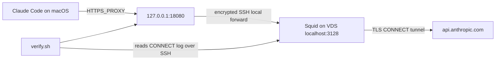

<div align="center">

# Claude Code VDS Proxy

### Auditable Claude Code routing through your own private VDS.

Squid CONNECT proxy, persistent SSH tunnel and fail-closed macOS controls.
No TLS interception. No public proxy port. No stored credentials.

[](https://github.com/by-sonic/claude-code-vds-proxy/actions/workflows/ci.yml)
[](LICENSE)
[](#requirements)
[](#requirements)
[](https://code.claude.com/docs/en/corporate-proxy)

**[Quick start](#quick-start)** · **[How it works](#how-it-works)** · **[Verification](#verification)** · **[Limitations](#limitations)**

**English** · **[Русский](README.ru.md)**

</div>

---

## Why this exists

Claude Code officially supports `HTTPS_PROXY`, `HTTP_PROXY` and `NO_PROXY`,
but a proxy setting alone does not prove which network path was actually used.
This kit builds a private route and then tests it from both ends:

- the proxy exit IP must match the VDS;
- Anthropic TLS must validate without a custom certificate;
- core Claude hosts must fail closed when bypassing the proxy;
- Squid must record the expected HTTPS `CONNECT` requests;
- every Claude Code update can be re-audited for proxy support and endpoints.

The result is reproducible routing evidence, not a "trust me" proxy switch.

## How it works



Squid listens only on VDS loopback. The VDS exposes SSH, not an open proxy.
HTTPS remains end-to-end encrypted between Claude Code and the destination.

## Security properties

- Squid is bound to `127.0.0.1` and reachable only through SSH forwarding.
- SSH key authentication and strict host-key checking are mandatory.
- No self-signed CA, TLS decryption or `NODE_TLS_REJECT_UNAUTHORIZED=0`.
- Passwords, OAuth tokens and API keys are never accepted by the installer.
- Core first-party hosts are mapped to non-routable local addresses for direct
  fail-closed checks while hostname-based CONNECT still resolves on the VDS.
- Non-essential Claude Code telemetry and feedback traffic are disabled with
  documented environment variables.
- Updates are followed by a binary endpoint audit and live route verification.

## Requirements

- macOS 13 or newer.
- Claude Code, or permission for the kit to install the official native build.
- Ubuntu or Debian VDS with `apt` and outbound HTTPS access.
- Existing SSH key access as `root` or a user with passwordless `sudo`.
- Python 3 on macOS for safe Claude `settings.json` updates.

The installer intentionally does not accept SSH passwords. Verify key access:

```bash
ssh -i ~/.ssh/id_ed25519 root@203.0.113.10
```

## Quick start

```bash
git clone https://github.com/by-sonic/claude-code-vds-proxy.git
cd claude-code-vds-proxy

./install.sh \
  --vds 203.0.113.10 \
  --ssh-user root \
  --identity ~/.ssh/id_ed25519 \
  --expect-exit-ip 203.0.113.10 \
  --maintenance weekly
```

Restart Cursor and all terminal windows after installation. Then run:

```bash
claude-vds-proxy-verify
```

`203.0.113.10` is a documentation address. Replace it with your VDS address.

### Installer options

| Option | Default | Purpose |
|---|---:|---|
| `--vds HOST` | required | VDS IP address or hostname |
| `--ssh-user USER` | `root` | Remote account with root or passwordless sudo |
| `--ssh-port PORT` | `22` | SSH port |
| `--identity PATH` | `~/.ssh/id_ed25519` | Existing private SSH key |
| `--local-port PORT` | `18080` | Local macOS proxy port |
| `--remote-port PORT` | `3128` | VDS loopback Squid port |
| `--expect-exit-ip IP` | auto-detect | Abort if VDS egress differs |
| `--maintenance MODE` | `off` | `off`, `daily`, or `weekly` update audit |

## What the installer changes

### On the VDS

- installs Squid, CA certificates and curl with `apt`;
- backs up and replaces `/etc/squid/squid.conf`;
- binds Squid to VDS loopback only;
- allows HTTPS CONNECT from local SSH-forwarded connections;
- enables and restarts the Squid service.

### On the Mac

- installs launchd jobs for the SSH tunnel and proxy environment;
- adds documented proxy/privacy variables to `~/.claude/settings.json` and
  `~/.zprofile`;
- adds a marked fail-safe block to `/etc/hosts`;
- installs lifecycle commands under `~/.local/bin`;
- stores non-secret connection settings under
  `~/.config/claude-vds-proxy`.

It does not edit Cursor's JSONC settings file. Cursor receives the proxy
environment through launchd after the app is restarted.

## Verification

```bash
claude-vds-proxy-verify
claude-vds-proxy-audit-installed-claude
```

`verify` checks the local listener, VDS exit IP, public TLS chain, fake-key API
reachability, direct-route blocking, launchd variables and Squid CONNECT logs.
HTTP `401` is expected for the deliberately invalid test key: it proves the
request reached the real Anthropic API without spending tokens.

The endpoint audit records the Claude Code version, SHA-256 and literal
first-party/auxiliary host strings under `~/.config/claude-vds-proxy/audits`.

## Updates

```bash
claude-vds-proxy-maintain --check
claude-vds-proxy-maintain --update
```

The updater detects native, npm and Homebrew installations, keeps two binary
backups, performs the update through the verified VDS route, audits the new
binary and reruns all route checks. Automatic maintenance is opt-in.

## Uninstall

```bash
./uninstall.sh
```

This removes the Mac launchd jobs, generated commands, proxy environment,
marked `/etc/hosts` and shell-profile blocks. It keeps audit history by default
and does not remove Squid from the VDS. The script prints the remote cleanup
command when it finishes.

## Limitations

This project controls a specific network route. It is not an anonymity tool,
an account-ban prevention service or a way to change product eligibility.
Claude services require users to be in a
[supported location](https://support.claude.com/en/articles/8461763-where-can-i-access-claude).
Use the project only where and how Anthropic's terms and local law permit.

- The fail-safe is host-based, not a system-wide packet firewall. Software
  using literal IPs, custom DNS/DoH or ignoring proxy variables can bypass it.
- `HTTPS_PROXY` and `HTTP_PROXY` are inherited by compatible child processes,
  not only Claude Code.
- MCP servers, shell commands, Git/SSH, WebFetch targets and external tools may
  connect to destinations chosen by the user or project.
- Bedrock, Vertex AI and Foundry use different provider endpoints.
- Browser traffic is outside the scope of this CLI-focused kit.
- A VDS provider and the destination can still observe connection metadata.

Read Anthropic's official
[enterprise proxy documentation](https://code.claude.com/docs/en/corporate-proxy)
and [environment variable reference](https://code.claude.com/docs/en/env-vars).

## Contributing

Bug reports and pull requests are welcome. Run the static checks first:

```bash
./tests/static.sh
```

See [CONTRIBUTING.md](CONTRIBUTING.md) and [SECURITY.md](SECURITY.md).

## License

MIT. See [LICENSE](LICENSE).
